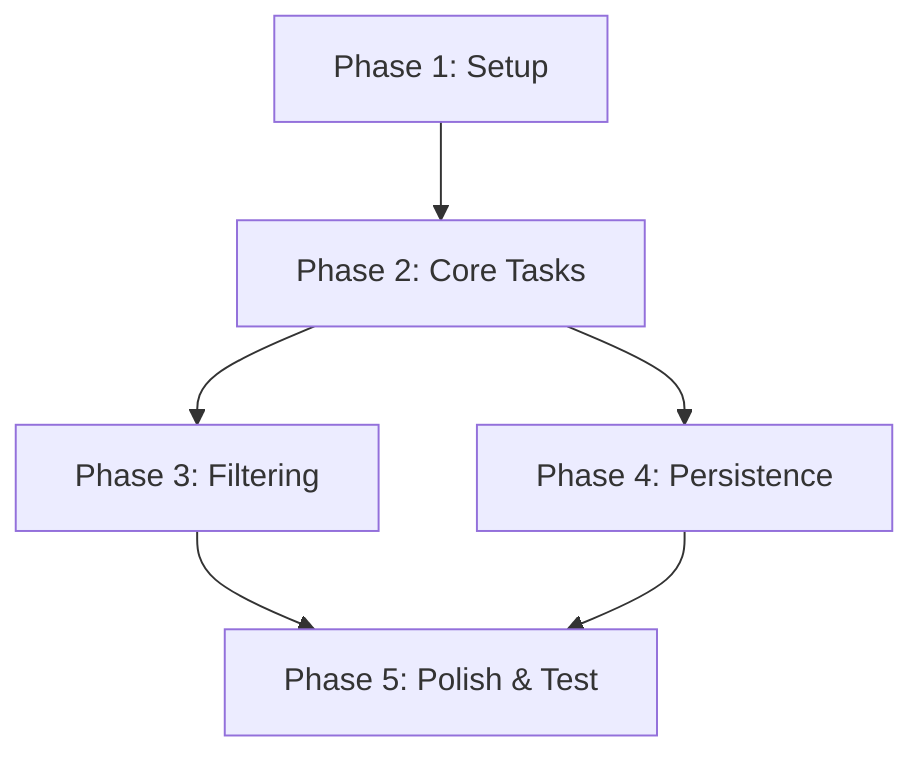

# Tasks: 個人用 ToDo アプリ

**Feature**: `001-todo-app`
**Status**: Draft

## Executive Summary

このドキュメントは、個人用ToDoアプリの実装タスクをフェーズおよびユーザーストーリーごとに依存関係順で定義したものです。

## Implementation Strategy

1. **Phase 1 (Setup)**: Next.js構成・Tailwind・shadcn/uiの導入とローカル永続化の基盤作成。
2. **Phase 2 (US1)**: タスクの追加・完了・編集・削除といったコア機能構築。MVPスコープ。
3. **Phase 3 (US2)**: 全て／未完了／完了済みのフィルタリングと画面反映。
4. **Phase 4 (US3)**: ローカルデータの永続化・クラッシュ耐性（US1と併用で強固にする）。
5. **Phase 5 (Polish)**: a11y（キーボードフォーカスなど）の最終調整と動作確認。

## Phase 1: Setup & Foundation

**Goal**: アプリ実行環境の準備と、UIコンポーネント、および localStorage 周辺の型定義と基礎ロジックを用意する。

- [ ] T001 Initialize Next.js app with Tailwind CSS (app router) in `/`
- [ ] T002 [P] Configure shadcn/ui and add required components (button, input, checkbox, toast) in `components/ui/`
- [ ] T003 [P] Define TypeScript interfaces (Task, FilterState) in `types/index.ts`
- [ ] T004 Implement safe localStorage I/O utility with error handling in `lib/storage.ts`

## Phase 2: User Story 1 - タスクの基本操作 (MVP)

**Goal**: ToDo機能の中核である「追加・完了切替・編集・削除」ができ、状態として保持できること。

**Manual Verification**: テキストを入力してタスクを追加でき、完了チェック、インライン編集、削除ボタン押下によるトーストUndo処理が全て機能すること。

- [ ] T005 [P] [US1] Create custom hook `use-todos.ts` for managing tasks state (add, toggle, edit, delete functions) in `hooks/use-todos.ts`
- [ ] T006 [US1] Build responsive main layout wrapper in `app/page.tsx`
- [ ] T007 [P] [US1] Create form component `task-input` for adding new tasks in `components/feature/task-input.tsx`
- [ ] T008 [P] [US1] Create listing component `task-item` (with checkbox, text, edit mode, delete button) in `components/feature/task-item.tsx`
- [ ] T009 [US1] Integrate `use-todos`, `task-input`, and `task-item` into the main view in `app/page.tsx`
- [ ] T010 [US1] Implement deletion confirmation using Undo Toast from shadcn/ui in `components/feature/task-item.tsx`

## Phase 3: User Story 2 - タスクのフィルタリング

**Goal**: 「すべて」「未完了」「完了済み」のボタンで表示されるタスクの一覧を切り替える。

**Manual Verification**: フィルタボタンをクリックした際、それに該当するステータスのタスクのみが表示されること。

- [ ] T011 [P] [US2] Update `use-todos.ts` hook to support fetching filtered list and storing current filter state in `hooks/use-todos.ts`
- [ ] T012 [US2] Create `filter-bar` UI component with selectable tabs in `components/feature/filter-bar.tsx`
- [ ] T013 [US2] Integrate `filter-bar` into main view and wire it up to render filtered tasks in `app/page.tsx`

## Phase 4: User Story 3 - データの永続化と安全な復元

**Goal**: US1とUS2で行った状態遷移を常に `localStorage` と同期し、破損時でもクラッシュしないようにする。

**Manual Verification**: タスク追加・フィルタ変更後にリロードしても状態が保たれており、DevToolsでストレージを破壊しても白紙にならず空のリストとして起動すること。

- [ ] T014 [US3] Connect `use-todos.ts` state changes to trigger `lib/storage.ts` writes on every update in `hooks/use-todos.ts`
- [ ] T015 [US3] Add initialization logic to `use-todos.ts` to load from `localStorage` on component mount in `hooks/use-todos.ts`
- [ ] T016 [US3] Implement and verify quota exceed (storage full) error handling gracefully via Toasts in `hooks/use-todos.ts`
- [ ] T016b [US3] Configure next-pwa or next-offline to cache static assets and serve app in complete offline environment

## Phase 5: Testing & Polish (a11y)

**Goal**: a11y要件（Tabキー遷移、フォーカスリング等）の完備。

**Manual Verification**: マウスを使わずTab/Enterのみで全操作が完了すること。

- [ ] T017 [P] Apply strict `focus-visible` styles and proper `aria-label` attributes to inputs, buttons, and checkboxes across `components/feature/` and `app/page.tsx`

## Dependencies

- **US1** requires **Setup** (core layout and types).
- **US2** requires **US1** (needs tasks to filter).
- **US3** requires **US1** & **Setup** (needs the storage util and task state to persist).
- **Testing & Polish** requires all functional stories (**US1, US2, US3**) to be complete.

