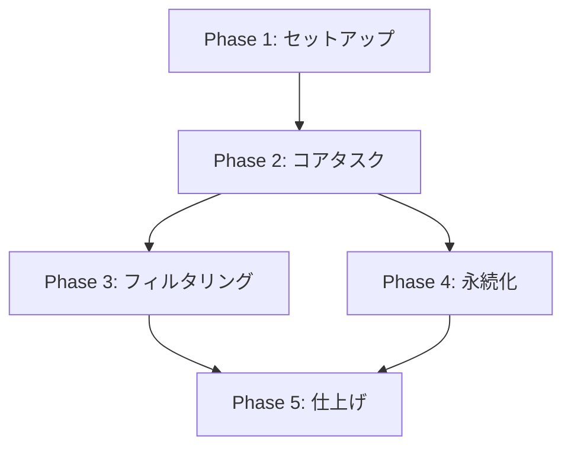

# Tasks: 個人用 ToDo アプリ

**Feature**: `001-todo-app`
**ステータス**: ドラフト

## エグゼクティブサマリー

このドキュメントは、個人用ToDoアプリの実装タスクをフェーズおよびユーザーストーリーごとに依存関係順で定義したものです。

## 実装戦略

1. **Phase 1 (Setup)**: Next.js構成・Tailwind・shadcn/uiの導入とローカル永続化の基盤作成。
2. **Phase 2 (US1)**: タスクの追加・完了・編集・削除といったコア機能構築。MVPスコープ。
3. **Phase 3 (US2)**: 全て／未完了／完了済みのフィルタリングと画面反映。
4. **Phase 4 (US3)**: ローカルデータの永続化・クラッシュ耐性（US1と併用で強固にする）。
5. **Phase 5 (Polish)**: a11y（キーボードフォーカスなど）の最終調整と動作確認。

## Phase 1: セットアップと基盤構築

**Goal**: アプリ実行環境の準備と、UIコンポーネント、および localStorage 周辺の型定義と基礎ロジックを用意する。

- [ ] T001 ルートディレクトリ `/` に Tailwind CSS（App Router）の Next.js アプリを初期化する
- [ ] T002 [P] `components/ui/` に shadcn/ui を設定し、必要なコンポーネント（button, input, checkbox, toast）を追加する
- [ ] T003 [P] `types/index.ts` に TypeScript インターフェース（Task, FilterState）を定義する
- [ ] T004 `lib/storage.ts` にエラーハンドリング付きの安全な localStorage I/O ユーティリティを実装する

## Phase 2: User Story 1 - タスクの基本操作 (MVP)

**Goal**: ToDo機能の中核である「追加・完了切替・編集・削除」ができ、状態として保持できること。

**Manual Verification**: テキストを入力してタスクを追加でき、完了チェック、インライン編集、削除ボタン押下によるトーストUndo処理が全て機能すること。

- [ ] T005 [P] [US1] `hooks/use-todos.ts` にタスク状態管理（追加・切替・編集・削除機能）のカスタムフック `use-todos.ts` を作成する
- [ ] T006 [US1] `app/page.tsx` にレスポンシブなメインレイアウトラッパーを構築する
- [ ] T007 [P] [US1] `components/feature/task-input.tsx` に新規タスク追加用フォームコンポーネント `task-input` を作成する（空白・空文字の投稿防止のバリデーション必須）
- [ ] T008 [P] [US1] `components/feature/task-item.tsx` に一覧表示コンポーネント `task-item` を作成する（チェックボックス・テキスト・編集モード・削除ボタン・長文字列の折り返し/省略表示対応必須）
- [ ] T009 [US1] `app/page.tsx` のメインビューに `use-todos`・`task-input`・`task-item` を統合する
- [ ] T010 [US1] `components/feature/task-item.tsx` に shadcn/ui の Undo トーストを使用した削除確認機能を実装する

## Phase 3: User Story 2 - タスクのフィルタリング

**Goal**: 「すべて」「未完了」「完了済み」のボタンで表示されるタスクの一覧を切り替える。

**Manual Verification**: フィルタボタンをクリックした際、それに該当するステータスのタスクのみが表示されること。

- [ ] T011 [P] [US2] `hooks/use-todos.ts` の `use-todos.ts` フックをフィルター済リスト取得と現在のフィルター状態の保存に対応するよう更新する
- [ ] T012 [US2] `components/feature/filter-bar.tsx` に選拡タブ付き `filter-bar` UIコンポーネントを作成する
- [ ] T013 [US2] `app/page.tsx` のメインビューに `filter-bar` を統合し、フィルターされたタスクのレンダリングと接続する

## Phase 4: User Story 3 - データの永続化と安全な復元

**Goal**: US1とUS2で行った状態遷移を常に `localStorage` と同期し、破損時でもクラッシュしないようにする。

**Manual Verification**: タスク追加・フィルタ変更後にリロードしても状態が保たれており、DevToolsでストレージを破壊しても白紙にならず空のリストとして起動すること。

- [ ] T014 [US3] `hooks/use-todos.ts` の `use-todos.ts` の状態変更時に `lib/storage.ts` への書き込みをトリガーするよう接続する
- [ ] T015 [US3] `hooks/use-todos.ts` の `use-todos.ts` にコンポーネントマウント時に `localStorage` から読み込む初期化ロジックを追加する
- [ ] T016 [US3] `hooks/use-todos.ts` にトースト経由でクォータ超過（ストレージ満杯）エラーハンドリングを実装・検証する
- [ ] T016b [US3] @serwist/next（または next-pwa）を設定し、静的アセットをキャッシュして完全オフライン環境でアプリを提供する

## Phase 5: テストと仕上げ（a11y）

**Goal**: a11y要件（Tabキー遷移、フォーカスリング等）の完備。

**Manual Verification**: マウスを使わずTab/Enterのみで全操作が完了すること。

- [ ] T017 [P] `components/feature/` および `app/page.tsx` 全体にストリクトな `focus-visible` スタイルと入力・ボタン・チェックボックスへの適切な `aria-label` 属性を適用する

## 依存関係

- **US1** は **セットアップ** が必要（コアレイアウトと型定義）。
- **US2** は **US1** が必要（フィルタリング対象のタスクが必要）。
- **US3** は **US1** と **セットアップ** が必要（ストレージユーティリティとタスク状態の永続化が必要）。
- **テストと仕上げ** は全機能ストーリー（**US1, US2, US3**）完了後に実施。

